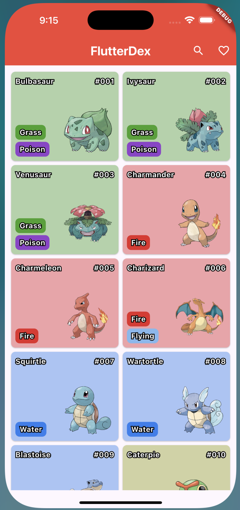

# FlutterDex

FlutterDex is a small, intentionally overengineered project designed to showcase how I would approach structuring and building a real-world Flutter application. The main goal is to demonstrate best practices, clean architecture, and scalable code organization, rather than simply delivering a minimal solution. This repository serves as a reference for tackling larger, production-ready projects using Flutter.

## Getting Started

### Prerequisites

- [Flutter SDK](https://docs.flutter.dev/get-started/install)
- Dart 3.8+

### Setup

1. Install dependencies:

   ```sh
   flutter pub get
   ```

2. Generate code (required for assets, json_serializable, etc):

   ```sh
   dart run build_runner build -d
   ```

3. Run the app:
   ```sh
   flutter run
   ```

## Project Structure

This project follows a clean architecture approach, as illustrated below:


<br/>

---

<br/>

- **Presentation**: Contains UI widgets and presentation logic holders (e.g., BLoC, ChangeNotifier).
- **Domain**: Contains use cases and entities, representing the business logic.
- **Data**: Handles data sources (remote APIs, local databases, etc.) and models.
- **Repositories**: Bridge between domain and data layers, providing data to use cases.

The call flow moves from UI to logic, to use cases, repositories, and finally to data sources (remote/local).

---

### Demo & Screenshots



#### Demo Video

<details>
<summary>Click to view demo</summary>
<video src="https://github.com/user-attachments/assets/97622dcb-2e56-4554-a95f-aed55ecd7ea2" controls width="400"></video>
</details>

---

For more help with Flutter development, see the [online documentation](https://docs.flutter.dev/).
